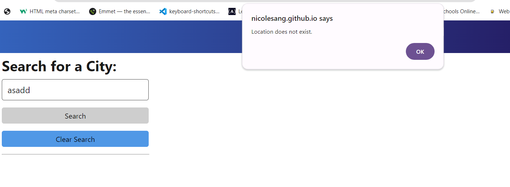

# WeatherInSight

This project is a web application that leverages the OpenWeatherMap API to provide users with current weather information and a 5-day forecast for a specified location. Key features include a clean display of current weather conditions, a forecast for the upcoming 5 days, and a convenient search history for quick access to past locations. The app is responsive and utilizes local storage to save search history between sessions.

## Usage

Deployed project URL: https://nicolesang.github.io/DailyTaskLog/

These screenshots shows how the web application should look:

Start your search by entering a location into the input box, then either press the 'enter' key or click the 'Search' button. This action will showcase the weather information for the current date and the next 5 days, and store your search in the history. 

Should you click on any of the saved locations in your search history, it will refresh and present the current weather for the chosen location. To delete your search history, just click on the 'Clear Search' button.

If the location you are trying to search does not exist, you will see an alert with this text: "Location does not exist."

## License
MIT License

Copyright (c) [2024] [Karen Nicole Santamaria Granizo]

Permission is hereby granted, free of charge, to any person obtaining a copy
of this software and associated documentation files (the "Software"), to deal
in the Software without restriction, including without limitation the rights
to use, copy, modify, merge, publish, distribute, sublicense, and/or sell
copies of the Software, and to permit persons to whom the Software is
furnished to do so, subject to the following conditions:

The above copyright notice and this permission notice shall be included in all
copies or substantial portions of the Software.

THE SOFTWARE IS PROVIDED "AS IS", WITHOUT WARRANTY OF ANY KIND, EXPRESS OR
IMPLIED, INCLUDING BUT NOT LIMITED TO THE WARRANTIES OF MERCHANTABILITY,
FITNESS FOR A PARTICULAR PURPOSE AND NONINFRINGEMENT. IN NO EVENT SHALL THE
AUTHORS OR COPYRIGHT HOLDERS BE LIABLE FOR ANY CLAIM, DAMAGES OR OTHER
LIABILITY, WHETHER IN AN ACTION OF CONTRACT, TORT OR OTHERWISE, ARISING FROM,
OUT OF OR IN CONNECTION WITH THE SOFTWARE OR THE USE OR OTHER DEALINGS IN THE
SOFTWARE.